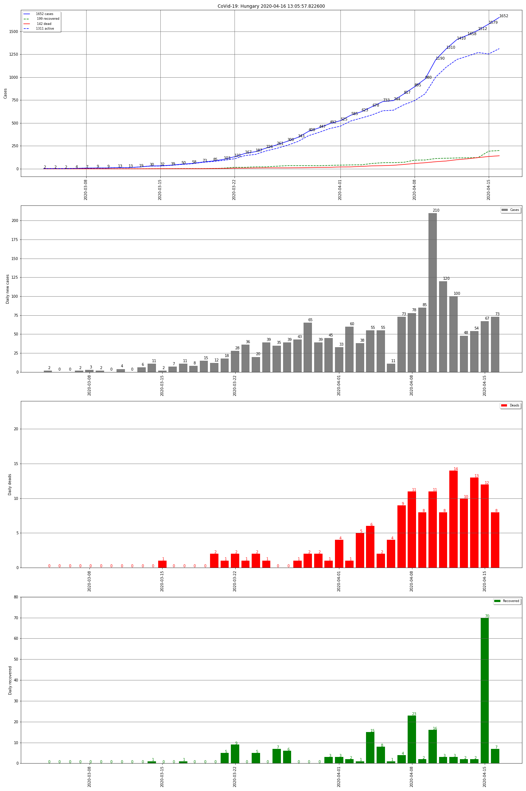

# covid #
CoVid-19 graphs for a country

st_corona.py is a streamlit app.



In the notebook you can define *the_country* variable, default is **Hungary**

The simple python scripts accept a parameter: *Country*
```
E.g.:
python3 covid.py Hungary
```
